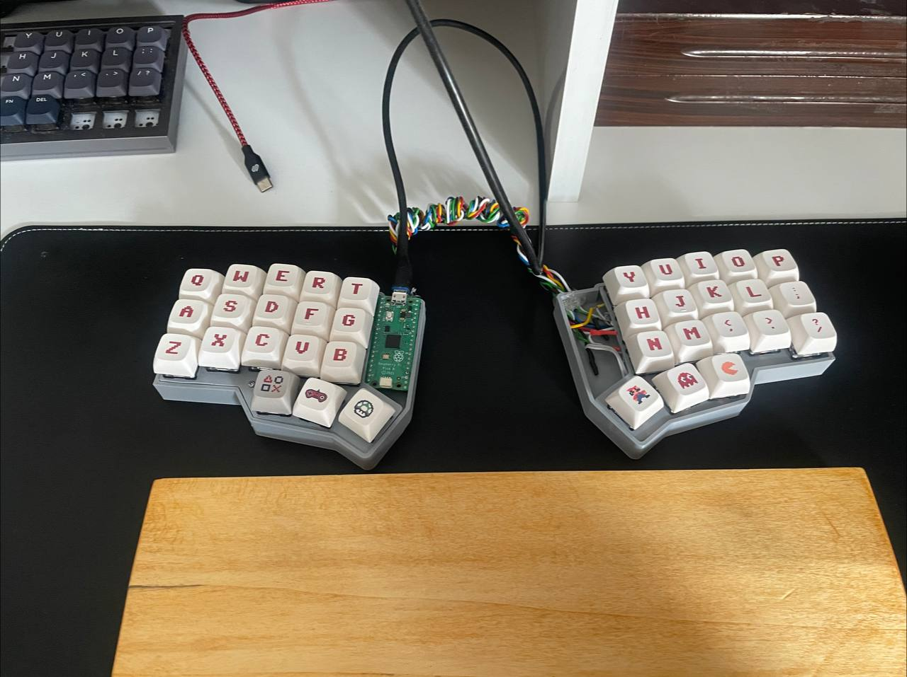

# my-handwired-keyboard

> Video for making handwired guide: https://www.youtube.com/watch?v=hjml-K-pV4E

## Usage 
- clone the repo : https://github.com/qmk/qmk_firmware
- open in vscode
- navigate to qmk_firmware/repo/path/keyboards/ folder
- create a folder name 'my-handwired-keyboard' and copy this repo content to it 
- make changes on keymap
- plug usb holding white switch on pi pico
- it will connect as RPI-RP2
- ready to drag and drop new UF2 file 
- run this script on corneleft folder
- qmk compile -kb my-handwired-keyboard -km default 
> if anything is wrong with qmk run this:  
> qmk_firmware/repo/path/util/qmk_install.sh  
- when qmk compile succeed it create my-handwired-keyboard.uf2 in qmk_firmware/repo/path/
- copy the uf2 file into RPI-RP2 by this command:
- cp qmk_firmware/repo/path/corneleft_default.uf2 /Volumes/RPI-RP2/corneleft_default.uf2
> on macos finder cant copy a file, so we need to use terminal